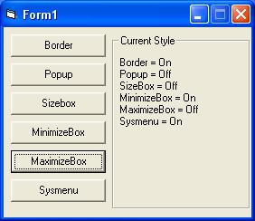



## Delete the form's border\!

### Description

With this code you can delete or apply the Border, Sizebox, MinimizeBox, MaximizeBox and Sysmenu Any time you want in a code :)

It uses SetWindowLong, I created a easy to use class, vote if you like it, or give comments!
 
### More Info
 

             |
---                |---
**Submitted On**   |2006-09-30 11:30:02
**By**             |[TV software](https://github.com/Planet-Source-Code/PSCIndex/blob/master/ByAuthor/tv-software.md)
**Level**          |Advanced
**User Rating**    |5.0 (15 globes from 3 users)
**Compatibility**  |VB 6\.0
**Category**       |[Custom Controls/ Forms/  Menus](https://github.com/Planet-Source-Code/PSCIndex/blob/master/ByCategory/custom-controls-forms-menus__1-4.md)
**World**          |[Visual Basic](https://github.com/Planet-Source-Code/PSCIndex/blob/master/ByWorld/visual-basic.md)
**Archive File**   |[Delete\_the2022509302006\.zip](https://github.com/Planet-Source-Code/tv-software-delete-the-form-s-border__1-66674/archive/master.zip)

